<h1 align="center">Ola, I'm Anas Wicaksono</h1>

 

## 👨🏻‍💻 About Me

I am a highly motivated student with a strong interest in data analysis, media, and digital information. Currently, I am pursuing a Bachelor of Applied Science (B.A.Sc.) in Applied Data Science at Politeknik Elektronika Negeri Surabaya (PENS). My passion lies in learning new things and contributing to meaningful projects by providing quality insights through effective data analysis. I enjoy exploring the intersection of technology and creativity, and in my free time, I actively develop my skills in graphic design and creative thinking.

I am always eager to collaborate on projects that challenge me to grow and expand my knowledge, especially in the fields of data science, visualization, and digital media. I believe that continuous learning and sharing knowledge are key to personal and professional development. If you are interested in discussing ideas, working together, or simply connecting, feel free to reach out to me via email at anaswicaksonoanas@gmail.com.

  

## 🛠 Skills & Technology

### 📚 Data Science & Analytics
<code><a href="https://github.com/nasswcksn" target="_blank">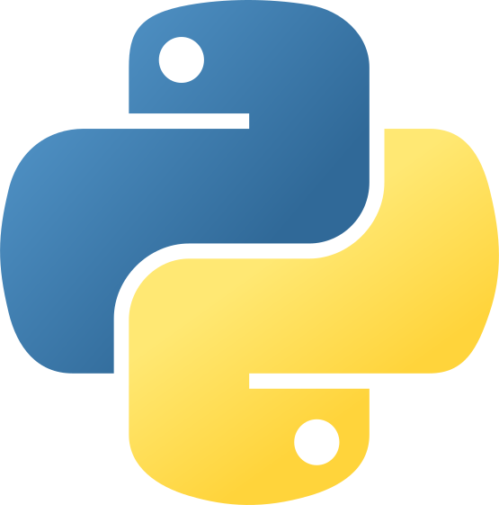</a></code>
<code><a href="https://github.com/nasswcksn" target="_blank">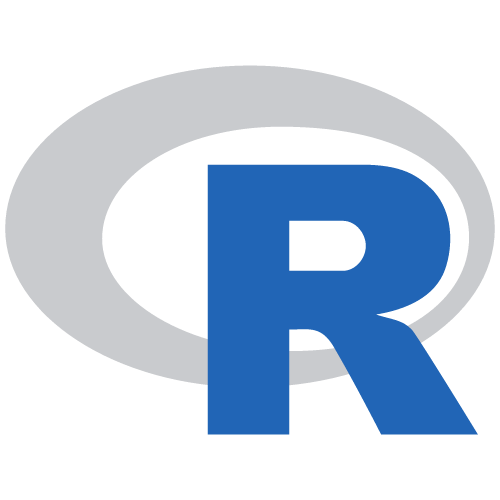</a></code>
<code></code>
<code></code>
<code></code>

### 🛠️ Data Engineer
<code></code>
<code><a href="https://github.com/nasswcksn" target="_blank">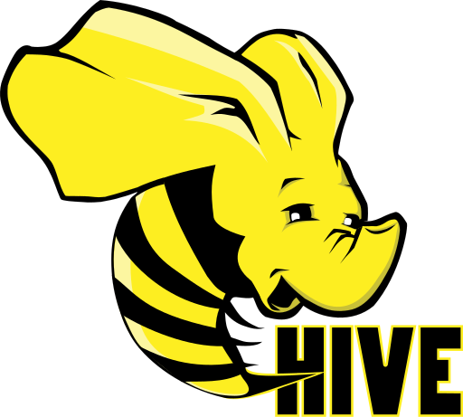</a></code>
<code><a href="https://github.com/nasswcksn" target="_blank">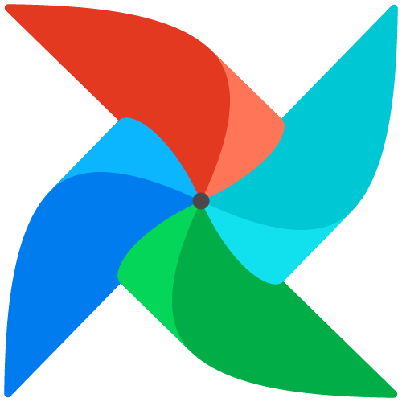</a></code>
<code><a href="https://github.com/nasswcksn" target="_blank">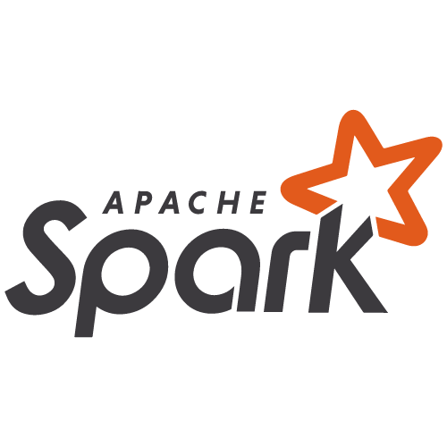</a></code>

### 🌐 Web Development
<code></code>
<code></code>
<code><a href="https://github.com/nasswcksn" target="_blank">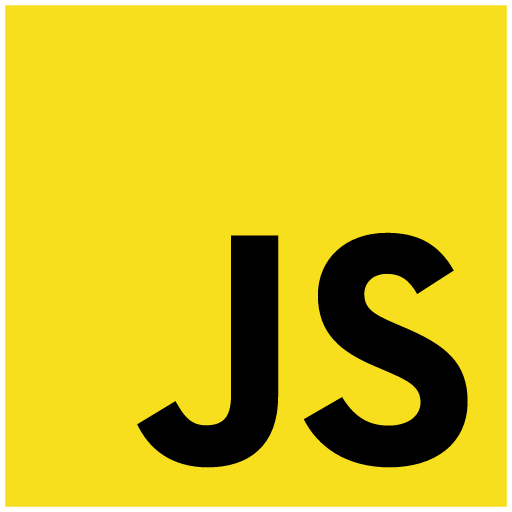</a></code>
<code><a href="https://github.com/nasswcksn" target="_blank">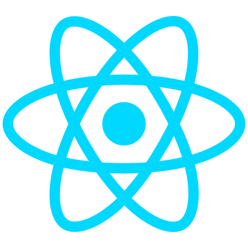</a></code>
<code><a href="https://github.com/nasswcksn" target="_blank">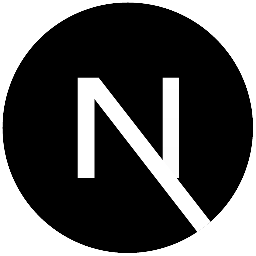</a></code>
<code><a href="https://github.com/nasswcksn" target="_blank">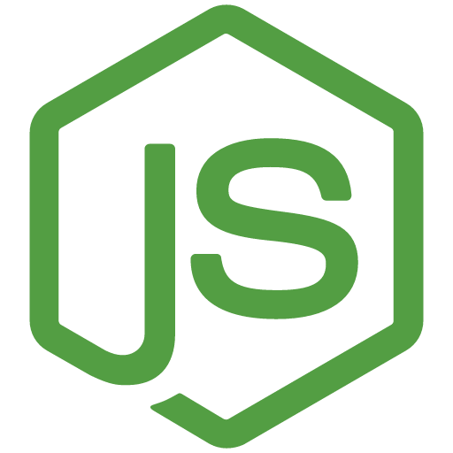</a></code>
<code></code>
<code><a href="https://github.com/nasswcksn" target="_blank">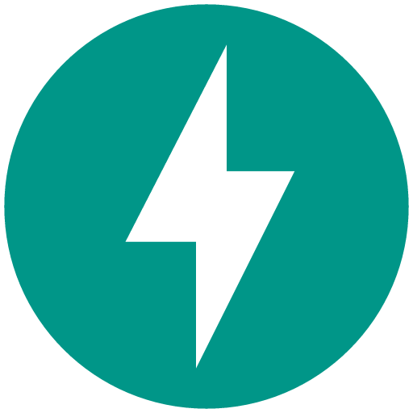</a></code>

### 💻 Tools & Platforms
<code><a href="https://github.com/nasswcksn" target="_blank">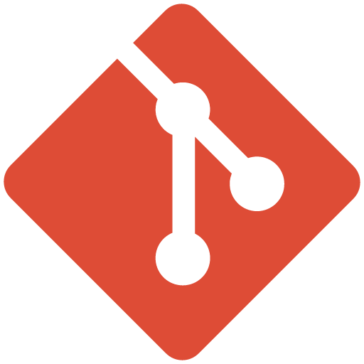</a></code>
<code><a href="https://github.com/nasswcksn" target="_blank">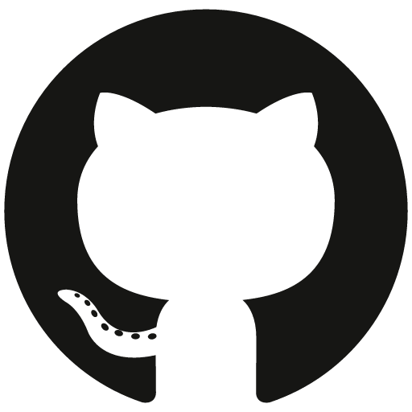</a></code>
<code></code>

### 🎨 Design & Visualization
<code></code>
<code><a href="https://github.com/nasswcksn" target="_blank">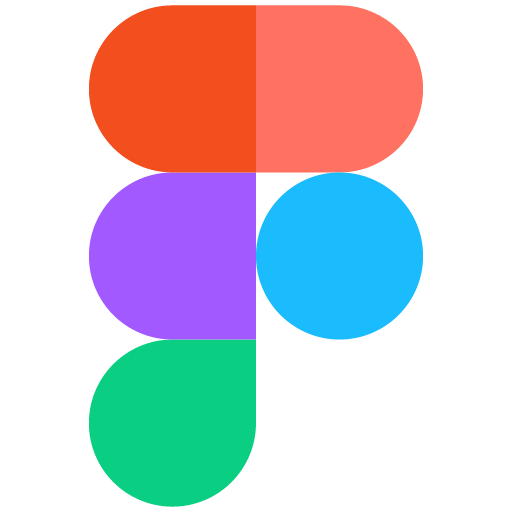</a></code>

## ⚙️ GitHub Analytics

## 🤝🏻 Contact Me

