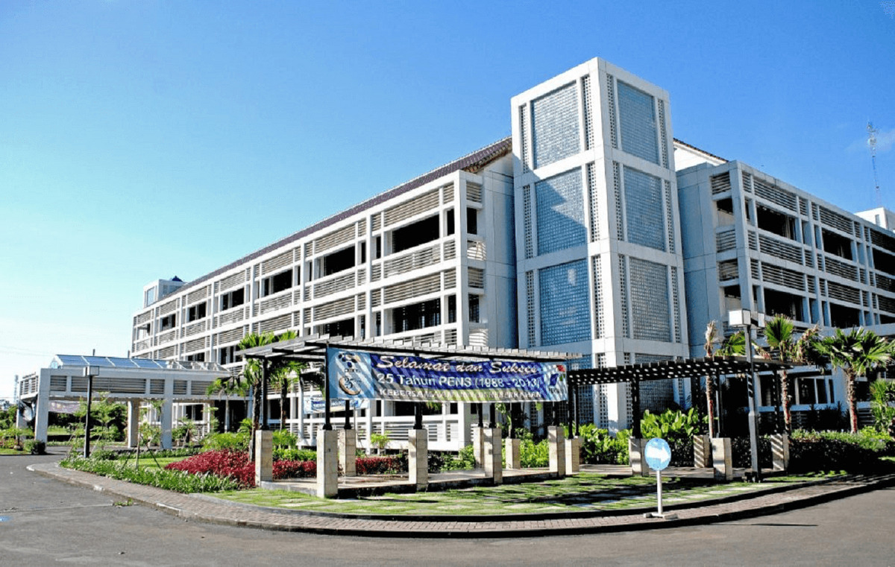

<!-- Banner dan Profil Institusi -->
<table>
<tr>
<!-- Logo Kampus PENS -->
<td valign="top"></td>
<td valign="top">
<h2>ANAS WICAKSONO</h2>

<b>Applied Data Science Student at Politeknik Elektronika Negeri Surabaya (PENS)</b>

Surabaya, East Java, Indonesia

</td>
</tr>
</table>

<!-- Banner Kampus (opsional, jika ingin menampilkan gambar kampus) -->

  

## 👨🏻‍💻 About Me

💡  I am a student with a keen interest in data analysis, media, and digital information. 
🎓  Currently pursuing a Bachelor of Applied Science (B.A.Sc.) in Applied Data Science. 
🌱  I am passionate about learning and contributing to providing quality insights through effective data analysis. 
✍️  In my free time, I actively hone my skills in Graphic Design and Creative Thinking. 
💬  Feel free to reach out for further discussions or collaboration opportunities. 
✉️  You can reach me by email at anaswicaksonoanas@gmail.com.

  

## 🛠 Skills & Technology

<!-- Tambahkan atau sesuaikan sesuai keahlian Anda -->
&nbsp;
&nbsp;
&nbsp;
&nbsp;
&nbsp;
&nbsp;
&nbsp;
&nbsp;
&nbsp;
&nbsp;
&nbsp;
&nbsp;
&nbsp;
&nbsp;
&nbsp;
&nbsp;
&nbsp;
&nbsp;
&nbsp;
&nbsp;
&nbsp;

## 🏆 GitHub Trophies

## ⚙️ GitHub Analytics

## 🤝🏻 Contact Me

